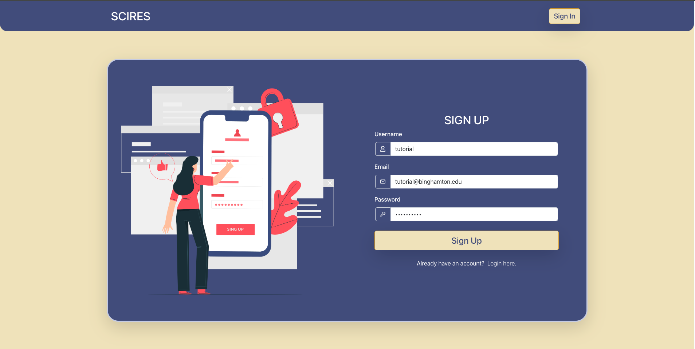
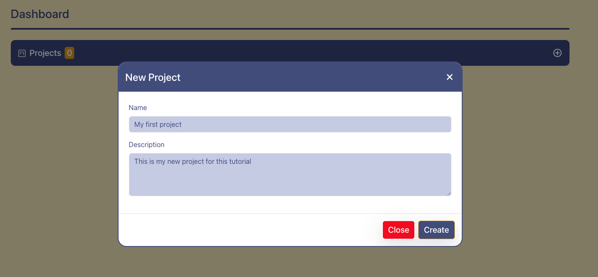
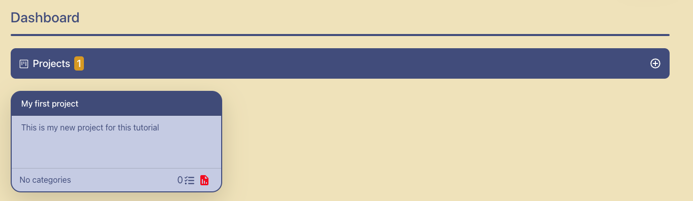
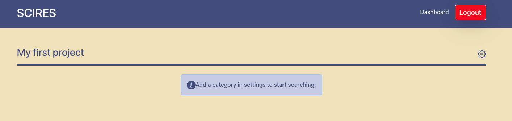
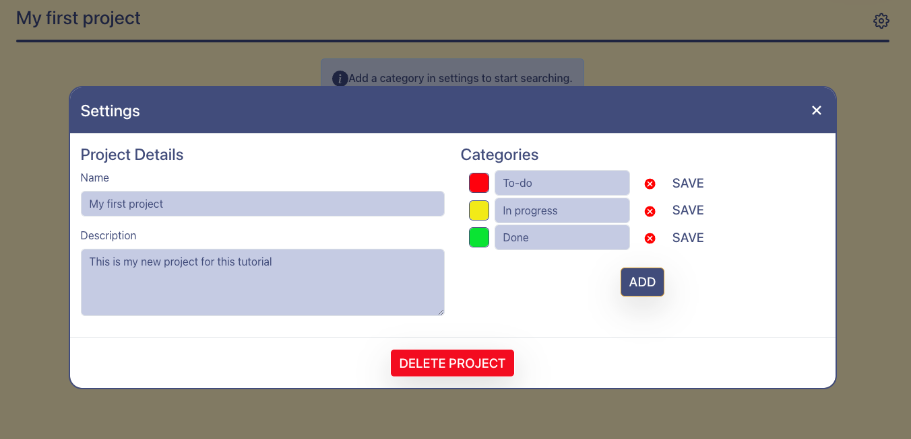
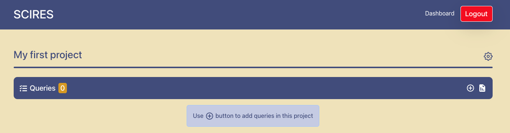
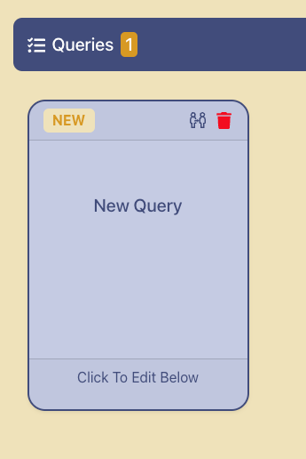
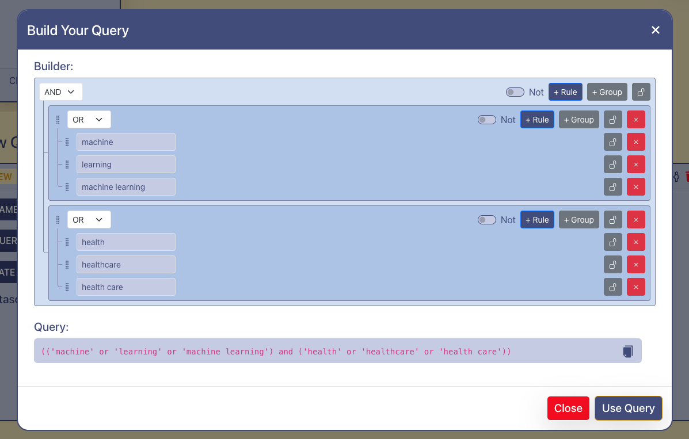
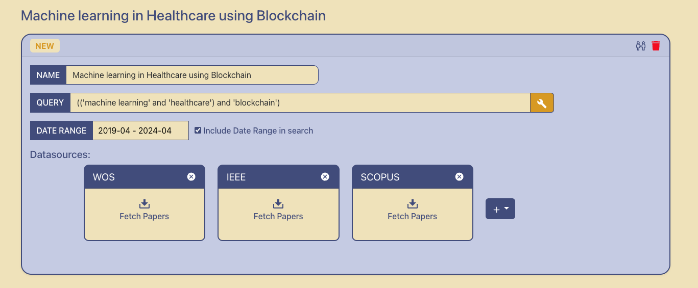

SCIRES Tutorial
===========================
In this tutorial, you will be be signing up on SCIRES to create a dummy project
and setup few queries to gather research articles across multiple databases.
This tutorial is aimed at people interested in learning how to use SCIRES to assist
in their research survey.

The only things you will need are a web browser, an Internet connection.
You can access `SCIRES <https://sysrev.cs.binghamton.edu/scires>`_ from any public domain.

Getting started
---------------

Setting up account
~~~~~~~~~~~~~~~~~~
To register an account, `open SCIRES <https://sysrev.cs.binghamton.edu/scires>`_
where you will see a yellow :guilabel:`Sign in` button.
Click it to open the login/registration view.
By default it will show you the login view, you can provide your login credentials if you already have an account,
or else you will see a hyperlink :guilabel:`Register here` click on that to open the registration view.
It will ask you for few details:

* Username: should be alphanumeric and unique that will be used to login.
* Email: provide you email address, this also must be unique.
* Password: should be alphanumeric that will be used to login.

After that, click on the yellow :guilabel:`Sign Up` button,
which will create your account on this system, if you receive any error make changes to above parameters accordingly.
Upon successful registration you will be be taken to the dashboard view, with no projects setup.

Creating first project
~~~~~~~~~~~~~~~~~~~~~~
On the project dashboard click on :guilabel:`+` icon button in the project panel to create a new project.
This will open a popup asking you details about your new project:

* Name: provide a meaningful name to your project, this can be updated later if necessary
* Description: provide a relevant description about your project, this can be updated later if necessary

Click on the blue :guilabel:`Create` button in the popup to create your first project.
You will see the project card is displayed with some summarized details about your project
and the project panel shows the total number of projects you've created so far, this case it would be from 0 to 1.

Configuring categories
~~~~~~~~~~~~~~~~~~~~~~
Once you've setup your first project, click on the `project card` to open the project view.

It's time to configure the categories that you would like to maintain for categorizing
the search results associated with the queries of this project.
To configure click on the :guilabel:`⚙` button to open project settings.

This would open a popup for the project settings where you can update project name/description, delete project and setup categories.
Click on the blue :guilabel:`ADD` button to add a category and you can add as many categories you would like for your project.

.. note::

   The first category that you create will be the default category that will be assigned to all the search results initially upon fetching.
   Ensure that you design in this in an meaningful manner.

We will setup few categories as shown below as part of this tutorial.
We can set specific colors and label to each category.

Upon creating them we need to individually save them by clicking on the :guilabel:`SAVE` button.
Once the categories are saved, close the project category dialog box.
This will enable the query panel, thus allowing us with the next steps to design and execute queries.

Designing queries
~~~~~~~~~~~~~~~~~

Drafting query
^^^^^^^^^^^^^^

Now that you've successfully created your account and configured your project and its settings,
it is time to design and execute your queries.
In order to create a query click on the :guilabel:`+` icon button on the query panel.
This will create a query draft and you can see the card below the query panel

Click on the card to design the query, this will open the query dialog. Provide the following details:

* Name: meaningful name associated with the nature of this query
* Query: actual query containing keywords and boolean operators such AND, OR
* Date Range: you can provide a month range `(optional)` parameter to search results between this range, ensure you enable the checkbox to include date range in search

To design queries there are two ways:

1. As an interdisciplinary researcher, if you're well-versed with the syntax of designing queries to search across these
scientific research databases, you can manually enter the query text
2. We have a tool called querybuilder to build queries that can help in designing meaningful queries that have higher
complexity such as nested logic, multiple kinds of operators which will also help in visualizing

Using querybuilder
^^^^^^^^^^^^^^^^^^
In order to use querybuilder click on the yellow :guilabel:`🔧` icon button in the query field, this will open a popup
showing the querybuilder dialog box. Now you can design query rules or create groups of sub-queries and continue building your intended logic.

Let us consider an example, I would like to find research papers relating to machine learning in healthcare using blockchain.
We need to identify the keywords for this query and divide them in groups:

* Group 1: could contain 'machine learning' and 'healthcare'
* Group 2: could contain just 'blockchain'
To accommodate all the permutations of the keywords in each group and also ensure inclusivity of both groups together
we would need to use both `AND` and `OR` operator

This can be easily design in query builder, to create group 1 simply click on the grey :guilabel:`+Group` button
and to add keywords inside or outside group click on the blue :guilabel:`+Rule` button

Click on the blue :guilabel:`Use Query` button at the bottom right of the dialog box
after you're done using the querybuilder to generate query text.

Executing query
^^^^^^^^^^^^^^^
Now that you've created a draft query, in order to preview search results:

1. Ensure you've added the query text manually or through querybuilder.
2. Set a meaningful name to this query in the name textbox.
3. Populate date range if necessary and select the checkbox if populated.
4. Click on :guilabel:`+` button to add databases to your query,
this will show you a dropdown containing the list of databases that are supported.

5. Once added this will create cards of the databases, you can click on the :guilabel:`Fetch Papers` button
to run your search across each query.
6. Upon searching we can see the amount of results that are fetched by each of the databases.
If you click on any of the :guilabel:`Fetched` buttons inside the database card, you will see the search results
for this particular query against that particular database.
7. You can also see the combined results by clicking on the :guilabel:`Show All` button,
this can also contain duplicate results as some results could be common across different databases.